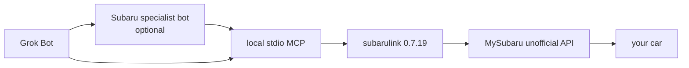
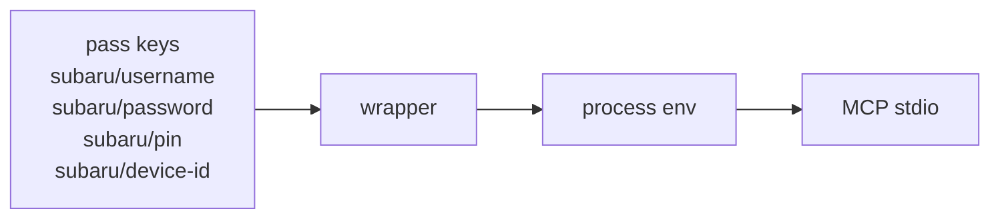
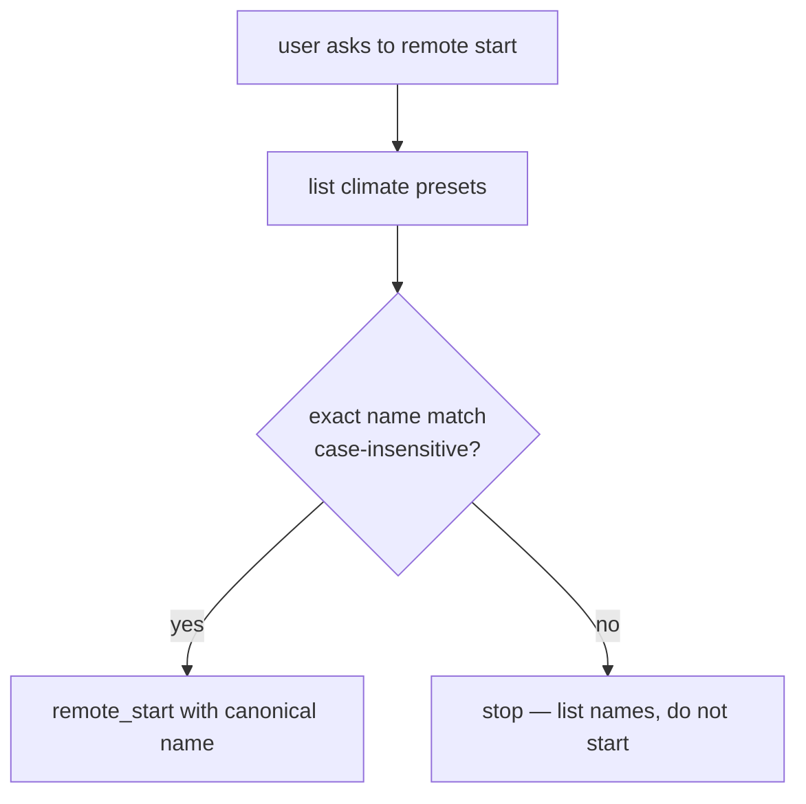

# Subaru STARLINK MCP for Grok Bot

A public recovery base for talking to MySubaru / STARLINK from Grok Bot over
stdio. No secrets live here. No VIN, no PIN, no passwords, no device ids.

This is a **local-first** MCP: your Grok Bot computer talks to the unofficial
MySubaru API through [`subarulink`](https://pypi.org/project/subarulink/0.7.19/).
There is no extra SaaS in the middle.

`subarulink` is reverse-engineered from the MySubaru mobile app and is
**Apache-2.0**. This repo's scripts and docs are **MIT**, Copyright 2026
Elder Lira. Not affiliated with Subaru of America or Subaru Corporation.

Username and PIN come from `pass` or env. Never a hardcoded address.

On Grok Bot, `$HOME` is often `/home/box` and the Unix user is `box`. Treat
those as examples. Use `$HOME` / `GROK_HOME` on your machine.

## Why

The official MySubaru app is fine on a phone. On a Grok Bot VM you want
stdio MCP: status, locate, climate presets, and (only when you explicitly
ask) lock / unlock / remote start. Local wrapper, local `pass`, no third-party
cloud that holds your MySubaru password.

## Architecture



The specialist bot is optional. Grok Bot can call this MCP directly.

Secrets never go on argv, git, or tool arguments:



## Remote start

Exact preset name match. A mismatch **stops**, lists the real names, and never
substitutes.



## Why subarulink 0.7.19

Grok Bot's Python is **3.13**. `subarulink==0.7.21` needs **Python >= 3.14**
and will not install.

`0.7.19` still has g2 remote start with named climate presets:

- `remote_start(vin, preset_name)` — VIN stays in process memory, never in tools
- `list_climate_preset_names(vin)`
- `get_climate_preset_by_name(vin, name)`

After you have Python 3.14+, you can bump (see below). You would pick up
MySubaru **g2v33**, Crosstrek **Full Cool** seat sanitizer, and a 240-minute
session age check.

## Vehicle generation

Works with **2019–2022 g2** gasoline STARLINK (not PHEV). A 2021 Crosstrek
Sport is a worked example, not the only vehicle.

- Remote start / lock need **MySubaru Security / Companion+** and vehicle
  feature **RES**.
- USA and Canada only. The reverse-engineered API can break without notice.
- Crosstrek **heated seats cannot be activated remotely** (the option is
  ignored by the car). Create climate presets in the official MySubaru app.
- Telematics snapshots are **not OBD-II**. They are often stale until
  `update()` / locate wakes the module. That wake can drain the **12V**
  battery if you overuse it.

| | MySubaru telematics (this MCP) | OBD-II |
|---|---|---|
| Path | Phone-app API → STARLINK module | Diagnostic port / dongle |
| Freshness | Often stale until a wake | Live while plugged in |
| Needs | Active MySubaru plan | Physical adapter |
| Lock / remote start | Yes, with Security / Companion+ | No |

If the account has one vehicle, tools take no VIN. If there are several, pass
the MySubaru **nickname**, or set `SUBARU_NICKNAME`. Never pass a VIN to a tool.

## Tools (16)

Reads (no extra confirmation):

- `subaru_status` — compact telematics snapshot (does not wake the car)
- `subaru_refresh_status` — `update()` wake, then snapshot (**12V drain**)
- `subaru_list_climate_presets` — names only
- `subaru_get_climate_preset(name)` — sanitized fields; `INVALID_PRESET` + names
- `subaru_locate` — wake, then lat/long only if `LOCATION_VALID` (**12V drain**)
- `subaru_tire_pressure` — TPMS or `UNSUPPORTED`
- `subaru_fuel_status`
- `subaru_odometer`

Controls — call only on **explicit user intent** for that exact action:

- `subaru_lock`
- `subaru_unlock`
- `subaru_remote_start(preset_name)` — list, exact match, never substitute
- `subaru_remote_stop`
- `subaru_horn` / `subaru_horn_stop`
- `subaru_flash_lights` / `subaru_lights_stop`

There is no generic execute / raw API tool. Success is claimed only when
`Controller` returned `True`. VIN / password / PIN / token / cookie are
stripped from errors and logs.

## Install

1. Clone **this** repo.
2. After clone, `chmod +x scripts/*.sh scripts/*.py` (the GitHub API cannot set executable bits).
3. Python 3.13 venv (Grok Bot example: `$HOME/.local/opt/subaru-mcp`):

```sh
python3.13 -m venv "$HOME/.local/opt/subaru-mcp/.venv"
cp -R src "$HOME/.local/opt/subaru-mcp/"
"$HOME/.local/opt/subaru-mcp/.venv/bin/pip" install -r requirements.txt
```

4. Copy `scripts/subaru-mcp-wrapper.py` and `scripts/subaru-mcp-login.sh`
   somewhere on `PATH` (Grok Bot example: `$HOME/.local/bin/`). Point
   `SUBARU_MCP_SRC` / `SUBARU_MCP_PYTHON` at the venv if you install elsewhere.
5. Store secrets (never paste them into chat or git):

```sh
pass insert -e subaru/username
pass insert -e subaru/password
pass insert -e subaru/pin
```

6. First-run 2FA (does **not** lock, unlock, or start the car):

```sh
scripts/subaru-mcp-login.sh
```

If the device is already registered it prints success without a VIN. If 2FA
is required it asks for a 6-digit code with hidden input (contact values are
masked). `subaru/device-id` is generated automatically if missing
(`$HOME/.local/share/subaru-mcp/device_id`, mode `0600`).

7. Register the MCP with Grok Bot.

## Grok Bot AddMcpServer example

Command is the wrapper. **Never** put password or PIN in env or git.

```json
{
  "command": "/usr/bin/python3",
  "args": ["/path/to/subaru-starlink-mcp-grokbot/scripts/subaru-mcp-wrapper.py"],
  "env": {
    "SUBARU_COUNTRY": "USA",
    "SUBARU_DEVICE_NAME": "grok-bot"
  }
}
```

Optional: `GROK_HOME`, `SUBARU_MCP_SRC`, `SUBARU_MCP_PYTHON`,
`SUBARU_USERNAME` (if you refuse `pass` for the username only),
`SUBARU_NICKNAME`. Do not set `SUBARU_PASSWORD`, `SUBARU_PIN`, or
`SUBARU_DEVICE_ID` in this registration.

On a Grok Bot VM the wrapper default layout is
`$HOME/.local/opt/subaru-mcp/` (example Unix user `box`, `$HOME=/home/box`).

If username / password / PIN are missing, the MCP **still starts** (stdio
handshake succeeds). Tools return `[AUTH_NOT_CONFIGURED]` with `pass insert`
hints.

## 12V drain

`subaru_refresh_status` and `subaru_locate` wake the STARLINK module. Do not
poll. A parked car with a weak 12V battery can fail to start after too many
wakes.

## How to bump subarulink after Python 3.14

1. `python3 --version` — needs 3.14+ for `subarulink==0.7.21+`.
2. Read https://pypi.org/project/subarulink/ (`requires_python`, changelog).
3. In the venv: `pip install 'subarulink==NEW'` and pin it in `requirements.txt`.
4. Confirm `Controller.remote_start(vin, preset_name)` and
   `list_climate_preset_names` still exist (or update `session.py`).
5. Run `pytest` (mocks only). Optional manual login — still **no**
   lock/start from automation.

## Tests

Mocks only. No live MySubaru network. **No live lock or remote start.**

```sh
python3.13 -m venv .venv
.venv/bin/pip install -r requirements.txt
.venv/bin/pytest
```

Fake VINs in tests are obviously fake (`JF2GTADC1MH000001`). They never leave
the test process.

## Unofficial API warning

Subaru has no public STARLINK API. USA/Canada only. This stack can stop
working when MySubaru changes. Use at your own risk.
